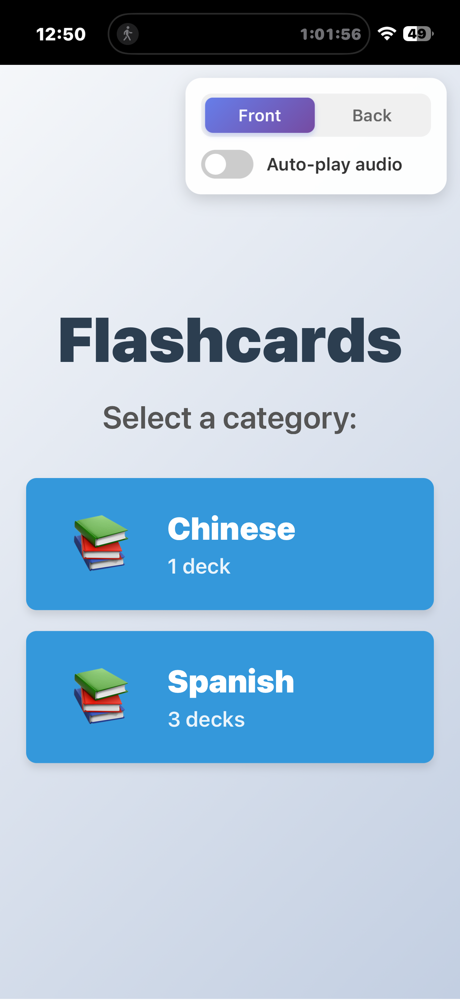
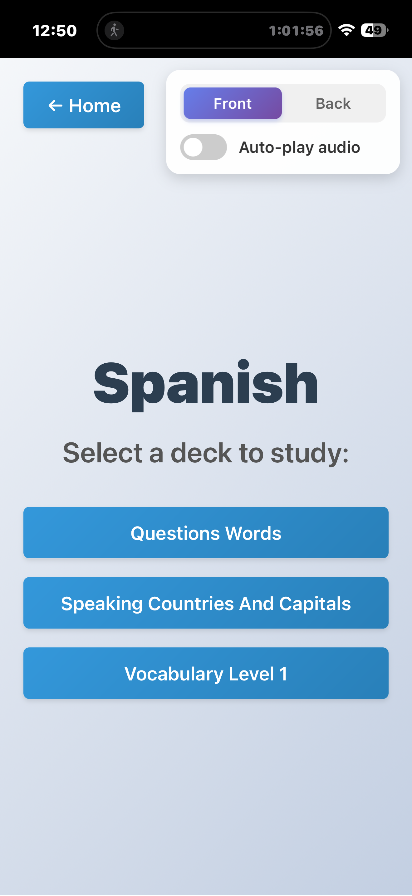
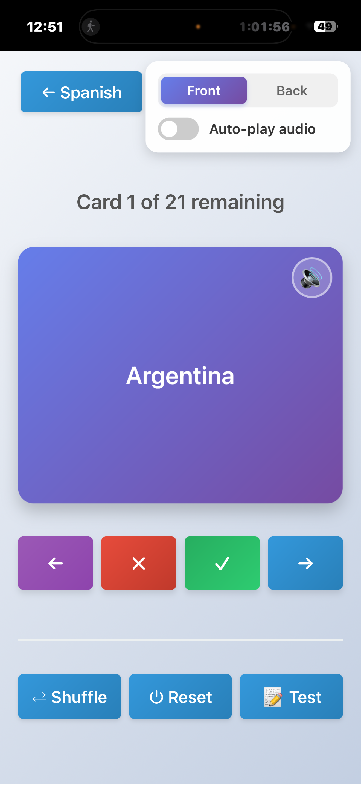

# Flashcards App

<p align="center">
  
</p>

<p align="center">
  <strong>A multi-language learning tool with interactive flashcards and audio pronunciation</strong>
</p>

<p align="center">
  <a href="https://flashcards.jpimobile.com">🌐 Try the Live Demo</a>
</p>

---

An interactive React application for learning multiple languages (Spanish, Chinese, Math concepts, and more) using flashcards with audio support. Features include spaced repetition, test mode, hierarchical category navigation, and AI-generated audio pronunciations.

## Screenshots

<p align="center">
  
  
  
</p>

## Live Demo

**Try the app:** <https://flashcards.jpimobile.com>

The flashcards app is deployed on a Raspberry Pi server running Apache.

## Features

### Core Features

- **Home page** with categorized topics:
  - Categories organized by subject (Spanish, Chinese, Math, etc.)
  - Each category shows available decks
  - Dynamically loaded from CSV files in the data folder
- **Category page** for browsing decks within a subject
- **Study page** with interactive flashcards:
  - Click any card to flip between front and back
  - **Audio playback** - Play pronunciation for each word with speaker button
  - **Auto-play mode** - Automatically play audio when showing cards (toggle in settings)
  - **Spaced repetition system**:
    - Mark cards as memorized (✓ Got It) or not yet memorized (✗ Not Yet)
    - Unmemoized cards reappear later in the deck
    - Track progress: cards remaining and cards memorized
    - Complete deck when all cards are memorized
  - **Test Mode**:
    - Shuffle all cards and test yourself
    - Track correct/incorrect answers
    - Review failed cards after completion
    - See your score and retake tests
  - **Deck controls**:
    - Previous button to undo accidental selections
    - Next button to skip cards
    - Shuffle deck to randomize card order
    - Reset to start over with all cards
    - Test mode to quiz yourself
  - **Math formula rendering**:
    - LaTeX math formulas rendered with KaTeX
    - Support for complex mathematical notation (fractions, exponents, trigonometric functions, etc.)
    - Dynamic font sizing based on formula length for optimal readability
    - Works on both front and back of cards
  - **Settings panel** (top-right):
    - Toggle between showing Front or Back first
    - Toggle auto-play audio
  - Progress indicator showing current card position
  - Responsive design with smooth flip animations
- **Hierarchical navigation**:
  - Back buttons showing context (e.g., "← Spanish", "← Home")
  - Clean navigation through categories

## Running the App

### Quick Start

```bash
./start.sh
```

### Manual Start

```bash
cd flashcards
npm start
```

The app will open automatically at <http://localhost:3000>

## How to Use

1. On the home page, select a category (e.g., Spanish, Chinese)
2. Select a deck to study
3. Click on any flashcard to flip between front and back
4. Use the Previous, Next, "✗ Not Yet", and "✓ Got It" buttons to navigate and memorize cards
5. Use "Test" button to quiz yourself on all cards
6. Click the back button (showing category name) to return to the category page

## Data Files

The flashcard app uses CSV files located in `flashcards/public/data/`:

**Spanish:**
- `spanish_vocabulary_level_1.csv` - Basic Spanish vocabulary
- `spanish_speaking_countries_and_capitals.csv` - Countries and capitals
- `spanish_question_words.csv` - Question words and phrases

**Chinese:**
- `chinese_history_I_lesson_5.csv` - Chinese history vocabulary

**Math:**

- Various math concept flashcards with LaTeX formulas (e.g., `math_derivative_of_common_functions.csv`)

The app automatically organizes CSV files into categories based on filename prefixes (e.g., `spanish_*.csv` → Spanish category).

## Creating New Flashcard Decks

Follow these steps to create a new flashcard deck:

### 1. Create the CSV File

Create a CSV file in `flashcards/public/data/` with the naming format: `{category}_{deck_name}.csv`

**Naming convention:**
- Use lowercase with underscores
- Start with category name (e.g., `spanish_`, `chinese_`, `math_`)
- Example: `spanish_vocabulary_level_2.csv`, `chinese_numbers.csv`

**CSV Format:**

The CSV file should have a header row and at least 2 columns:

```csv
Front,Back
hello,hola
goodbye,adiós
thank you,gracias
```

**Math Formulas:**

For math flashcards, use LaTeX notation wrapped in `$...$` delimiters:

```csv
Function,Derivative
$f(x)=x^n$,$f'(x)=nx^{n-1}$
$f(x)=\sin(x)$,$f'(x)=\cos(x)$
$f(x)=\ln(x)$,$f'(x)=\frac{1}{x}$
```

The app will automatically render LaTeX math formulas using KaTeX with support for:
- Fractions: `\frac{a}{b}`
- Exponents and subscripts: `x^2`, `a_n`
- Greek letters: `\alpha`, `\beta`, `\theta`
- Trigonometric functions: `\sin`, `\cos`, `\tan`
- Square roots: `\sqrt{x}`
- And many more LaTeX math commands

**Advanced CSV Features:**

**Secondary Text Display:**

Add additional columns with headers ending in "1" or "2" to show secondary text below the primary text on cards:

- Headers ending in "1" (e.g., "Pinyin 1", "Extra Info 1") show secondary text on the **front** of the card (column 1)
- Headers ending in "2" (e.g., "English Meaning 2", "Hint 2") show secondary text on the **back** of the card (column 2)

```csv
Chinese,Pinyin 1,English Meaning 2
装饰,zhuāngshì,Decoration; to decorate
考古,kǎogǔ,Archaeology
```

In this example:
- Front shows "装饰" with "zhuāngshì" below it (secondary text)
- Back shows "Archaeology" with no secondary text

**Audio Column Mapping:**

By default, each card face uses its own column's text to retrieve audio files. You can override this by adding a number to the column header:

- Headers ending with a number (e.g., "Pinyin 1", "English 3") use that column's text for audio retrieval
- The number refers to the column position (1-based): 1 = first column, 2 = second column, etc.

```csv
Chinese,Pinyin 1,English Meaning 2
田租,tián zū,land rent
```

In this example:
- Front displays "田租" but uses column 1 (itself) for audio → plays "田租.wav"
- Back displays "tián zū" but uses column 1 ("Chinese") for audio → plays "田租.wav"
- Both sides share the same audio file

**Rules:**
- If the referenced column is out of range or empty, no audio button appears
- Numbers in secondary text headers (ending in "1" or "2") control secondary text display only
- Numbers in primary headers (first two columns) control audio retrieval only
- Audio always uses the primary text (not secondary text) for the specified column

**Notes:**
- First row is the header (column names)
- Column headers are used for language detection (e.g., "Spanish", "English", "Chinese")
- You can have more than 2 columns for secondary text and audio mapping
- For Chinese cards, include headers like "Chinese" or "中文" for language detection
- CSV cells containing commas must be quoted (e.g., "Yuanmou (a county in Yunnan, famous for Yuanmou Man)")

### 2. Generate Audio Files (Optional)

Generate audio pronunciation files for your flashcards:

```bash
# Basic usage
uv run tools/generate_flashcard_audio.py flashcards/public/data/{category}_{deck_name}.csv

# With column filtering (e.g., skip pinyin)
uv run tools/generate_flashcard_audio.py flashcards/public/data/chinese_numbers.csv --ignore pinyin
```

This creates a folder `{category}_{deck_name}/` with audio files for each unique word.

### 3. Update the Manifest

Update the app's manifest to include your new deck:

```bash
uv run tools/update_manifest.py
```

This scans all CSV files and updates `manifest.json` with categories and decks.

### 4. Restart the App

If the app is running, refresh the page to see your new deck appear in the appropriate category.

### Example: Creating a Spanish Colors Deck

```bash
# 1. Create the CSV file
cat > flashcards/public/data/spanish_colors.csv << 'EOF'
English,Spanish
red,rojo
blue,azul
green,verde
yellow,amarillo
EOF

# 2. Generate audio
uv run tools/generate_flashcard_audio.py flashcards/public/data/spanish_colors.csv

# 3. Update manifest
uv run tools/update_manifest.py

# 4. Refresh the app - "Colors" will appear under "Spanish" category
```

## Managing Flashcard Manifest

When you add, remove, or rename CSV files in `flashcards/public/data/`, run:

```bash
uv run tools/update_manifest.py
```

This updates `manifest.json` with the current available flashcard sets, organizing them by category.

## Audio Generation Tools

Python scripts that generate audio pronunciations for multiple languages using Google's Gemini TTS API with Google Cloud Text-to-Speech as a fallback.

### Audio Features

- **Dual API Support**: Automatically tries Gemini TTS first, falls back to Google Cloud TTS if needed
- **Language Detection**: Automatically detects language from CSV column headers
- **Multi-language Support**: Spanish (es-US), English (en-US), and Chinese (zh-CN) voices
- **Voice Options**: Neural2 (high-quality) or WaveNet (premium) voices
- **Column Filtering**: Skip specific columns using `--ignore` option
- **Click-free Audio**: Implements SSML silence padding and audio trimming to eliminate initial click sounds
- **Test Mode**: Test TTS APIs before generating full audio sets

### Generic Audio Generator (Recommended)

Generate audio files for any CSV flashcard file:

```bash
uv run tools/generate_flashcard_audio.py <csv_file_path>
```

**Examples:**

```bash
# Generate audio for Spanish vocabulary
uv run tools/generate_flashcard_audio.py flashcards/public/data/spanish_vocabulary_level_1.csv

# Generate audio for Chinese vocabulary (ignoring pinyin column)
uv run tools/generate_flashcard_audio.py flashcards/public/data/chinese_history_I_lesson_5.csv --ignore pinyin

# Generate audio for countries and capitals
uv run tools/generate_flashcard_audio.py flashcards/public/data/spanish_speaking_countries_and_capitals.csv
```

**Column Filtering with `--ignore`:**

Skip specific columns by number (1-based) or header name (case-insensitive):

```bash
# Ignore column 2 (pinyin)
uv run tools/generate_flashcard_audio.py data.csv --ignore 2

# Ignore by header name (case-insensitive)
uv run tools/generate_flashcard_audio.py data.csv --ignore pinyin

# Ignore multiple columns
uv run tools/generate_flashcard_audio.py data.csv --ignore pinyin --ignore 3
```

The script will:

- Read all unique words from specified columns of the CSV (excluding ignored columns)
- Detect language automatically based on column headers (Spanish/English/Chinese)
- Create an output folder with the same name as the CSV file (without .csv)
- Generate WAV files for each word using appropriate language voice
- Skip files that already exist to avoid redundant API calls
- Automatically fallback to Google Cloud TTS if Gemini API fails

**Output Structure:**

```text
flashcards/public/data/
|-- spanish_vocabulary_level_1.csv
|-- spanish_vocabulary_level_1/
|   |-- el_muchacho.wav
|   |-- boy.wav
|   +-- ...
|-- spanish_speaking_countries_and_capitals.csv
+-- spanish_speaking_countries_and_capitals/
    |-- Argentina.wav
    |-- Buenos_Aires.wav
    +-- ...
```

### Test Mode

Test TTS APIs before generating audio for full CSV files:

```bash
# Test with auto fallback (default: Neural2 voice)
uv run tools/generate_flashcard_audio.py --test "Hola mundo"
uv run tools/generate_flashcard_audio.py --test "Hello world" --lang en

# Test specific API
uv run tools/generate_flashcard_audio.py --test "Buenos días" --api gemini
uv run tools/generate_flashcard_audio.py --test "Good morning" --lang en --api cloud

# Test with WaveNet voice
uv run tools/generate_flashcard_audio.py --test "Hello world" --lang en --voice-type wavenet
```

**Test Mode Options:**

- `--test TEXT`: Text to generate audio for
- `--lang {es,en,zh}`: Language (default: es)
- `--api {gemini,cloud,auto}`: API to use (default: auto)
- `--voice-type {neural2,wavenet}`: Voice type for Google Cloud TTS (default: neural2)

Audio files are saved to `/tmp/spanish_tts_test/` with timestamp for comparison.

### API Configuration

**API Keys Setup:**

This project uses two TTS APIs:

1. **Google Gemini TTS** (primary) - Uses Leda voice for Spanish
2. **Google Cloud Text-to-Speech** (fallback) - Uses Neural2/WaveNet voices

**Step 1: Gemini API Key**

1. Create a `.env` file in the project root:

   ```bash
   cp .env.example .env
   ```

2. Add your Google Gemini API key to the `.env` file:

   ```env
   GEMINI_API_KEY=your_api_key_here
   ```

   Get your API key from: <https://makersuite.google.com/app/apikey>

**Step 2: Google Cloud Credentials**

1. Download your Google Cloud service account JSON key file

2. Add the path to your `.env` file:

   ```env
   GOOGLE_APPLICATION_CREDENTIALS=/path/to/your/service-account-key.json
   ```

   Example:

   ```env
   GOOGLE_APPLICATION_CREDENTIALS=/Users/yourname/projects/spanish/gen-lang-client-XXXXX.json
   ```

**Complete .env file example:**

```env
GEMINI_API_KEY=your_gemini_api_key_here
GOOGLE_APPLICATION_CREDENTIALS=/Users/yourname/projects/spanish/gen-lang-client-XXXXX.json
```

**Voice Configuration:**

- **Gemini TTS**:
  - Voice: `Leda` (Spanish voice)
  - Output: PCM converted to WAV (24kHz)

- **Google Cloud TTS**:
  - Spanish: `es-US-Neural2-A` (Neural2) or `es-US-Wavenet-A` (WaveNet)
  - English: `en-US-Neural2-F` (Neural2) or `en-US-Wavenet-F` (WaveNet)
  - Chinese: `cmn-CN-Neural2-A` (Neural2) or `cmn-CN-Wavenet-A` (WaveNet)
  - Output: LINEAR16 WAV (24kHz)

Audio files are cached to avoid redundant API calls.

## Project Structure

```text
spanish/
  flashcards/           # React flashcard application
    public/data/        # CSV files, audio folders, and manifest.json
    src/                # React components
  data/                 # Source CSV data files (legacy)
  tools/                # Python utility scripts
    generate_flashcard_audio.py  # Generate audio for any CSV file
    update_manifest.py           # Update manifest.json with available CSVs
  main.py               # Main entry point
  start.sh              # Launch script for flashcard app
```

## Dependencies

### Flashcard App

- React
- React Router DOM

Install with:

```bash
cd flashcards
npm install
```

### Python Scripts

Dependencies are managed via `uv` (see `pyproject.toml`):

- pandas - CSV processing
- requests - API calls
- python-dotenv - Environment variable management
- tqdm - Progress bars
- google-cloud-texttospeech - Google Cloud TTS API

Install Python dependencies:

```bash
uv sync
```

If you don't have `uv` installed:

```bash
curl -LsSf https://astral.sh/uv/install.sh | sh
```

## Changelog

### Version 1.2 (October 2025)

#### Math Formula Rendering

**LaTeX Support:**

- **KaTeX Integration**: Render mathematical formulas using LaTeX notation
  - Wrap formulas in `$...$` delimiters (e.g., `$x^2 + y^2 = z^2$`)
  - Supports complex notation: fractions, exponents, Greek letters, trigonometric functions
  - Examples: `$\frac{1}{x}$`, `$x^{n-1}$`, `$\sin(x)$`, `$\sqrt{1-x^2}$`
- **Dynamic Font Sizing**: Automatically adjusts font size based on formula length
  - Longer formulas (>100 chars) use smaller font (1rem)
  - Medium formulas (>70 chars) use 1.2rem
  - Shorter formulas maintain larger size for readability
  - Ensures formulas fit on one line without wrapping
- **Works Everywhere**: Math rendering functions on front, back, and secondary text
- **Preserves Existing Features**: All functionality (flipping, audio, spell mode) works with math cards

**Testing:**

- Added 3 new e2e tests specifically for math formula rendering
- Tests verify KaTeX elements render correctly
- Tests confirm dynamic font sizing is applied
- Tests ensure math formulas persist after card flip

**Dependencies:**

- Added `katex@^0.16.25` for math rendering
- Added `react-katex@^3.1.0` for React integration

### Version 1.1 (October 2025)

#### Secondary Text & Audio Column Mapping

**Advanced CSV Features:**

- **Secondary Text Display**: Show additional text below primary text on flashcards
  - Add columns with headers ending in "1" or "2" (e.g., "Pinyin 1", "English Meaning 2")
  - Headers ending in "1" display secondary text on front of card (column 1)
  - Headers ending in "2" display secondary text on back of card (column 2)
  - Secondary text appears below primary text in smaller italic font
  - Automatically wraps for long text
  - Shows/hides together with primary text in Spell Mode

- **Audio Column Mapping**: Control which column's text is used for audio retrieval
  - Add a number to column headers (e.g., "Pinyin 1") to reference a different column for audio
  - Number refers to column position (1-based): 1 = first column, 2 = second column, etc.
  - Example: "Pinyin 1" displays pinyin but plays audio for Chinese characters (column 1)
  - Both sides can reference the same column to share audio files
  - No audio button shown if referenced column is out of range or empty
  - Properly handles quoted CSV fields with commas

**CSV Parsing Improvements:**

- Added robust CSV parser supporting quoted fields with commas
- Handles escaped quotes (double quotes) within quoted fields
- Example: `"Yuanmou (a county in Yunnan, famous for Yuanmou Man)"` parses correctly as single field

**UI Enhancements:**

- Audio button only shown when audio file is actually available (checks content-type header)
- Secondary text styled with smaller font, italic, and slight opacity
- Responsive font sizing for secondary text on mobile devices

#### Spell Mode & Enhanced Study Features

**New Study Mode:**

- **Spell Mode**: Audio-first learning feature for spelling practice
  - Text hidden by default when showing cards
  - Click card to reveal text and verify spelling
  - Auto-play audio automatically enabled in Spell Mode
  - Text automatically hides when navigating to new cards
  - Smooth fade transitions when switching Front/Back in Spell Mode
  - Perfect for practicing spelling and pronunciation without visual cues

**Visual Feedback Animations:**

- **"Got It" Button**: Card nods forward 3 times (acknowledgment animation) when marking cards as memorized
- **"Not Yet" Button**: Card shakes horizontally (disagreement animation) when marking cards as not memorized
- Animations provide immediate tactile feedback for user actions
- 800ms duration matching the timing of card transitions

**UI Improvements:**

- **Settings Panel Enhancement**: Settings panel now scrolls with page content (changed from fixed to absolute positioning)
- **Test Mode Privacy**: Settings panel hidden during test mode to prevent mid-test configuration changes
- **Completion Screen Styling**:
  - Warmer color palette for completion cards (cream/peach tones instead of blue-gray)
  - Consistent button styling across all completion screens
  - Proper button sizing and alignment on mobile devices
  - Improved readability with better contrast
- **Navigation Improvements**:
  - Back buttons on study pages show category name (e.g., "← Spanish")
  - "Home" buttons on completion screens properly navigate to home page
  - Test completion and congratulations screens have separate navigation flows
- **Mobile Optimization**: Improved mobile layout with proper alignment and spacing
  - Settings panel properly aligned with back button
  - Content positioned to avoid overlap with settings
  - Reduced spacing between button groups for better use of screen space
  - Completion cards fit within screen width with responsive text sizing
  - "Congratulations!" heading scales down on mobile (2.5rem → 1.8rem)
- **Consistent Card Colors**: Card background colors always match data columns (Column 1 = purple gradient, Column 2 = pink gradient) regardless of Front/Back toggle setting
  - Eliminates confusion when switching between Front and Back views
  - Visual consistency helps reinforce which side of the card is showing

**Testing:**

- Added comprehensive e2e tests for Spell Mode (6 new test cases)
- Added e2e tests for completion screens and test mode (5 new test cases)
- Updated timing in tests to account for new animation durations (800ms + transitions)
- Fixed test reliability issues with toggle switch interactions
- Improved test assertions to handle floating-point precision
- All tests passing with proper animation wait times

**Bug Fixes:**

- Fixed audio NotAllowedError handling for browser security
- Fixed text reveal state management in Spell Mode
- Fixed Front/Back switch transitions to prevent text flashing
- Fixed settings panel mobile positioning issues
- Fixed "Reset" button test with proper transition timing
- Fixed completion screen button text inconsistencies

**Documentation:**

- Updated README with Spell Mode features
- Added comprehensive feature documentation for animations
- Documented test running commands
- Added project structure overview

### Version 1.0 (October 2025)

#### Multi-Language Support & Hierarchical Navigation

**Major Features:**
- **Multi-language support**: Extended beyond Spanish to support Chinese, Math, and other subjects
- **Hierarchical navigation**: Reorganized app with Home → Category → Study flow
- **Category organization**: Flashcards automatically grouped by filename prefix (e.g., `spanish_*.csv`, `chinese_*.csv`)
- **Chinese language support**: Added Chinese TTS with Mandarin voices and language detection
- **Contextual navigation**: Back buttons now show category names (e.g., "← Spanish", "← Chinese")

**UI/UX Improvements:**
- Language-agnostic settings panel with Front/Back toggle instead of "Spanish first"
- Segmented control design for better visual clarity
- Removed breadcrumb navigation in favor of consistent back button style
- Updated all page titles from "Spanish Flashcards" to "Flashcards"
- Added app icon and screenshots to README

**Audio Generation Enhancements:**
- Added `--ignore` option to skip specific columns by number or name
- Extended language detection to support Chinese keywords (中文, Mandarin, etc.)
- Added Chinese voice configuration for Google Cloud TTS (cmn-CN)
- Support for zh-CN language code

**Data Management:**
- Added `update_manifest.py` tool to automatically organize CSV files by category
- Renamed `vocabulary_level_1.csv` to `spanish_vocabulary_level_1.csv` for consistency
- Added `chinese_history_I_lesson_5.csv` with audio files
- Hierarchical manifest.json structure with categories and nested decks

**Testing:**
- Updated all e2e tests for new navigation flow
- Added tests for category navigation and contextual back buttons
- Updated test assertions for language-agnostic UI

**Documentation:**
- Comprehensive README updates with screenshots and app icon
- Added "Creating New Flashcard Decks" section with step-by-step guide
- Updated deployment URL from spanish-flashcards.jpimobile.com to flashcards.jpimobile.com
- Documented multi-language features and hierarchical navigation

**Previous Features:**
- Test mode with score tracking and failed card review
- Spaced repetition system with "Got It" / "Not Yet" buttons
- Auto-play audio toggle
- Responsive design with smooth animations
- Undo functionality with Previous button

## License

MIT License
